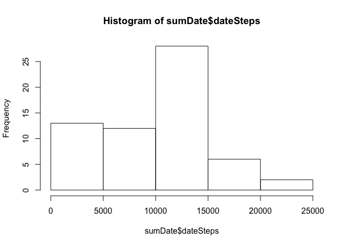
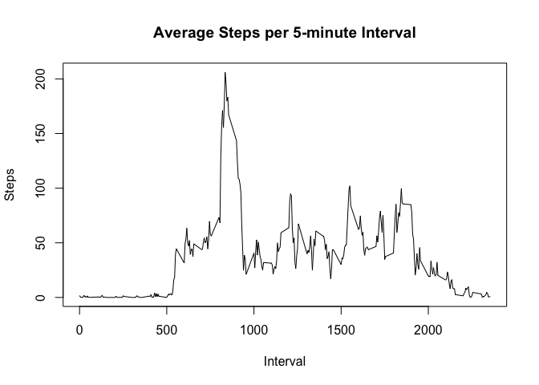
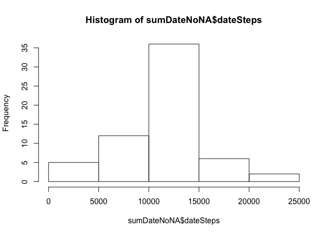
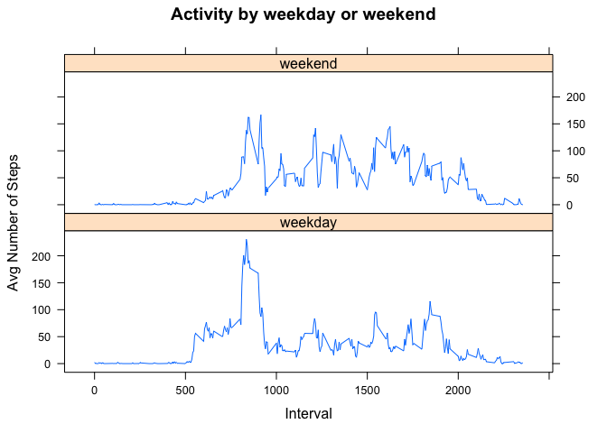

# Reproducible Research: Peer Assessment 1
Dale Mumper  
6/11/2017  


## Loading and preprocessing the data

```r
temp <- tempfile()
download.file("https://d396qusza40orc.cloudfront.net/repdata%2Fdata%2Factivity.zip", temp)
data <- read.csv(unz(temp, "activity.csv"))
unlink(temp)
```

## What is mean total number of steps taken per day?
For this part of the assignment, you can ignore the missing values in the dataset.  
1. Calculate the total number of steps taken per day  

```r
library(dplyr)
```

```
## 
## Attaching package: 'dplyr'
```

```
## The following objects are masked from 'package:stats':
## 
##     filter, lag
```

```
## The following objects are masked from 'package:base':
## 
##     intersect, setdiff, setequal, union
```

```r
byDate <- group_by(data, date)
sumDate <- summarize(byDate, dateSteps = sum(steps, na.rm=TRUE))
```

2. If you do not understand the difference between a histogram and a barplot, [research](http://stattrek.com/statistics/charts/histogram.aspx?Tutorial=AP) the difference between them. Make a histogram of the total number of steps taken each day  

```r
hist(sumDate$dateSteps)
```

<!-- -->

3. Calculate and report the mean and median of the total number of steps taken per day  

```r
dateStepsM <- summarize(sumDate, meanSteps = mean(dateSteps), medianSteps = median(dateSteps))
dateStepsM
```

```
## # A tibble: 1 x 2
##   meanSteps medianSteps
##       <dbl>       <int>
## 1   9354.23       10395
```

## What is the average daily activity pattern?
1. Make a time series plot (i.e. type = "l") of the 5-minute interval (x-axis) and the average number of steps taken, averaged across all days (y-axis)

```r
byMin <- group_by(data, interval)
sumMin <- summarize(byMin, minSteps = mean(steps, na.rm=TRUE))
plot(sumMin$interval, sumMin$minSteps, type="l", xlab="Interval", ylab="Steps", main="Average Steps per 5-minute Interval")
```

<!-- -->

2. Which 5-minute interval, on average across all the days in the dataset, contains the maximum number of steps?

```r
sumMin[ which(sumMin$minSteps == max(sumMin$minSteps)), ]
```

```
## # A tibble: 1 x 2
##   interval minSteps
##      <int>    <dbl>
## 1      835 206.1698
```

## Imputing missing values
Note that there are a number of days/intervals where there are missing values (coded as NA). The presence of missing days may introduce bias into some calculations or summaries of the data.
1. Calculate and report the total number of missing values in the dataset (i.e. the total number of rows with NAs)

```r
sum(!complete.cases(data))
```

```
## [1] 2304
```

2. Devise a strategy for filling in all of the missing values in the dataset. The strategy does not need to be sophisticated. For example, you could use the mean/median for that day, or the mean for that 5-minute interval, etc.

```r
print("My strategy is to use the mean for that 5-minute interval to fill in missing values")
```

```
## [1] "My strategy is to use the mean for that 5-minute interval to fill in missing values"
```

3. Create a new dataset that is equal to the original dataset but with the missing data filled in.

```r
data["newCol"] <- ifelse(is.na(data$steps)==TRUE, round(sumMin$minSteps[sumMin$interval %in% data$interval]), data$steps)
dataNoNA <- data[, c("newCol", "date", "interval")]
names(dataNoNA)[1] <- "steps"
```

4. Make a histogram of the total number of steps taken each day and Calculate and report the *mean* and *median* total number of steps taken per day. Do these values differ from the estimates from the first part of the assignment? What is the impact of imputing missing data on the estimates of the total daily number of steps?

```r
byDateNoNA <- group_by(dataNoNA, date)
sumDateNoNA <- summarize(byDateNoNA, dateSteps = sum(steps, na.rm=TRUE))

hist(sumDateNoNA$dateSteps)
```

<!-- -->

```r
dateNoNAStepsM <- summarize(sumDateNoNA, meanSteps = mean(dateSteps), medianSteps = median(dateSteps))
dateNoNAStepsM
```

```
## # A tibble: 1 x 2
##   meanSteps medianSteps
##       <dbl>       <dbl>
## 1  10765.64       10762
```

Yes, there is a difference between the estimates from teh first part of the assignment. The mean goes from 9,354 up to 10,765, and the median goes from 10,395 up to 10,762. The total daily number of steps goes up for each day as well. This is due to replacing the NA values (essentially ignored with na.rm = TRUE) with a non-zero positive number.

## Are there differences in activity patterns between weekdays and weekends?
For this part, the weekdays() function may be of some help here. Use the dataset with the filled-in missing values for this part.
1. Create a new factor variable in the dataset with two levels - "weekday" and "weekend" indicating whether a given date is a weekday or weekend day.

```r
dataNoNA$weekday <- factor(ifelse(weekdays(as.Date(dataNoNA$date)) %in% c("Saturday", "Sunday"), "weekend", "weekday"))

byMinNoNA <- group_by(dataNoNA, interval)
sumMinNoNA <- summarize(byMinNoNA, minSteps = mean(steps, na.rm=TRUE))

sumDateNoNA$weekday <- factor(ifelse(weekdays(as.Date(sumDateNoNA$date)) %in% c("Saturday", "Sunday"), "weekend", "weekday"))
```

2. Make a panel plot containing a time series plot (i.e. type="l") of the 5-minute interval (x-axis) and the average number of steps taken, averaged across all weekday days or weekend days (y-axis). See the README file in the GitHub repository to see an example of what this plot should look like using simulated data.

```r
library(lattice)
wkdy <- group_by(dataNoNA, weekday, interval)
wkdySum <- summarize(wkdy, avg = mean(steps))
xyplot(wkdySum$avg~wkdySum$interval|wkdySum$weekday, main="Activity by weekday or weekend", xlab="Interval", ylab="Avg Number of Steps", layout=c(1,2), type="l")
```

<!-- -->
